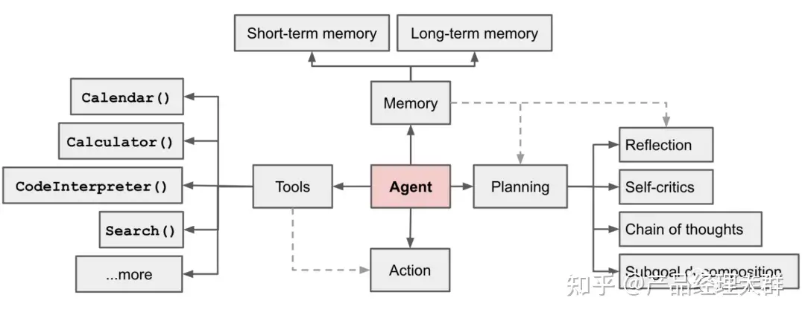
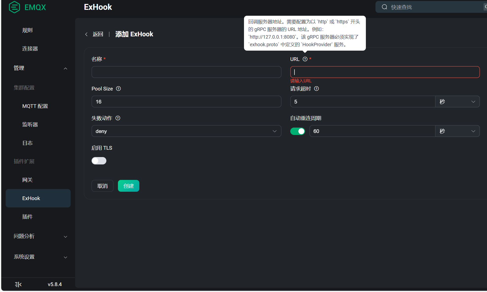
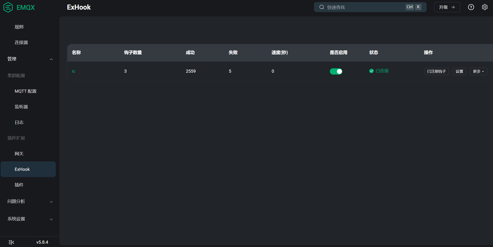

## 什么是物联网平台内核
> 物联网平台内核定义

物联网平台内核是一个轻量级的物联网平台，包含了物联网最核心的基础模块，
包括物模型、监控、AI、MQTT、微信小程序、微信服务号等模块。该平台旨在帮助开发者快速搭建物联网应用，提高开发效率。
物联网平台内核并不包括ui组件，只提供基础的api接口，开发者可以自由选择自己喜欢的ui框架来搭建应用。

## 什么是Agent智能体
Agent智能体可以自我学习。智能体是一种通用问题解决器。从软件工程的角度看来， 
智能体是一种基于大语言模型的，具备规划思考能力、记忆能力、使用工具函数的能力，能自主完成给定任务的计算机程序。
目前已经有很多的智能体框架，如langchain,promptulate和agently。但给智能体编写工具并不是一件非常容易的
事情，需要掌握良好的提示工程技术和抽象能力，因此本物联网内核提供了Agent智能体的抽象，并直接提供了可用的工具
集合，做到真正的开箱即用。


## 什么是物模型
物模型是物联网平台内核的基础模块，它定义了物联网设备的功能和属性，例如开关、亮度、温度、湿度等。
本物联网平台内核提供了物模型管理模块，用户可以轻松管理物联网设备的功能和属性。

## 安装部署流程

### 一、容器化环境初始化
1. 进入项目docker目录执行以下命令：
```bash
cd docker && docker-compose up -d
```
* 该操作将自动创建并启动以下服务容器：
    - MySQL 数据库服务
    - Redis 缓存服务
    - EMQX MQTT消息中间件(https://www.emqx.com/zh)
    - InfluxDB 时序数据库

2. 验证容器状态（可选）：
```bash
docker-compose ps
```

### 二、应用配置指引
1. 修改`application.yaml`配置文件，配置数据库连接：
```yaml
spring:
  influx:
    user: cwl
    # 你的数据库url
    url: http://[容器IP]:8086
    password: [数据库密码]
    mapper-location: top.rslly.iot.dao
    dataBaseName: data
    retention: autogen     #保存策略
  datasource:
    url: jdbc:mysql://[容器IP]:3306/[数据库名]?useSSL=false&characterEncoding=UTF-8
    username: [数据库用户名]
    password: [数据库密码]
  redis:
    host: [容器IP]
    port: 6379
    password: [redis密码]
```

2. 配置持久层参数（建议生产环境使用update模式）：
```yaml
jpa:
  hibernate:
    ddl-auto: update # 自动更新表结构，保留数据
  show-sql: false    # 生产环境建议关闭SQL日志
```

### 三、首次启动注意事项
1. 容器IP建议替换为实际Docker网络地址（可通过`docker network inspect bridge`查询）
2. 首次启动建议设置`ddl-auto: create`初始化数据库结构，后续改为update
3. 刚启动时候数据库没有用户数据，因而无法登录，请手动添加管理员用户数据进行初始化，role为admin,password格式为 `{bcrypt}XXXX`
   XXX为bcrypt加密后的密文，具体请看SpringSecurity的加密规则。
   
   > user表的结构
4. 各中间件默认端口如被占用，需同步调整docker-compose.yaml中的端口映射配置
5. 生产环境建议配置独立的数据库账号并设置访问白名单
6. 内网环境需要使用穿透技术，如frp软件。

### 四、配置exhook
> 多语言的 钩子扩展 由 emqx-exhook 插件进行支持。它允许用户使用其它编程（例如：Python、Java 等）直接向 EMQX 挂载钩子，
  以接收并处理 EMQX 系统的事件，达到扩展和定制 EMQX 的目的。

1. 登录emqx dashboard ，点击菜单：插件扩展 -> Exhook -> 添加
   
   > 特别注意：由于本机使用docker安装EMQX服务器，因此上面的地址不能填写locahost（127.0.0.1），
   具体ip请根据实际情况进行填写。
2. 开启exhook插件


### 五、微信小程序和微信服务号接入
1. 在application.yaml中配置微信小程序和微信服务号的appid和appsecret，以及微信的ToUserName，ToUserName是小程序的微信号。
   可以通过截获微信服务器的请求获取。
```yaml
wx:
  debug: true  (生产模式下请设置为false，否则无法获取access_token)
  appid: XXXXXX (服务号appid)
  appsecret: XXXXXX (服务号appsecret)
  templateUrl: XXXXX (模板消息跳转的链接)
  alarmTemplateId: XXXXXX (模板消息的模板id)
  micro: (小程序)
    appid: XXXXXX
    appsecret: XXXXXX
    ToUserName: XXXXXX
    appid2: XXXXXX
    ToUserName2: XXXXXX
    appsecret2: XXXXXX
  msg:
    token: XXXXXX
```
2. 将项目的api添加到微信开放平台，并配置好回调地址，然后就可以通过微信小程序或者微信服务号进行愉快的玩耍了。
   详情请参考微信开放平台文档。(https://developers.weixin.qq.com/doc/offiaccount/Basic_Information/Access_Overview.html)
3. 如果需要使用消息推送功能的用户，请配置好模板消息模板，具体请参考微信开放平台文档。
### 六、邮件配置
> 邮件系统配置对于物联网平台至关重要，它可以提供注册验证，以及后续上线的邮件通知功能和密码找回功能等。
  请按照以下模板进行配置。
```yaml
mail:
    host: smtp.126.com
    port: 465
    protocol: smtps
    username: ruanzhen1234@126.com[你的邮件地址]
    password: XXX
    default-encoding: UTF-8
    properties:
      mail:
        smtp:
          ssl: true
  thymeleaf:
    cache: true
    mode: html
    prefix: classpath:/templates/
    encoding: UTF-8
    servlet:
      content-type: text/html
```
smtp邮件服务器配置，需要到邮箱服务商申请，并配置好相关参数，相关配置请参考对应的邮件服务商文档。
### 七、联网搜索selenium安装
>如果你不需要使用AI联网搜索，那么至此处恭喜你，你已经拥有一个属于自己的物联网平台了，祝你愉快。
但如果需要使用AI联网搜索，那么你需要安装selenium，selenium是一个开源的浏览器自动化测试工具，
它可以自动模拟浏览器行为，如点击、输入、提交表单等，从而实现自动化测试和模拟用户操作。

1. 安装服务器无头谷歌浏览器。
```bash
wget https://dl.google.com/linux/direct/google-chrome-stable_current_amd64.deb
sudo dpkg -i google-chrome*.deb
sudo apt-get install -f
```
查看当前浏览器版本
```bash
google-chrome --version
```
2. 配置运行的chrome驱动
先下载对应版本的chromedriver(http://npm.taobao.org/mirrors/chromedriver/)
解压到自己方便寻找的目录
```bash
unzip chromedriver_linux64.zip
```
3.配置application.yaml文件
```yaml
ai:
  chromeDrive-path: [chromedriver路径]
  chrome-path: [chrome可执行文件路径]
  audio-tmp-path: [临时音频文件存放路径]
  audio-temp-url: [项目运行的域名]
  glm-key: 
  deepSeek-key: 
  dashscope-key: 
  robot-name: [机器人名称]
  team-name: 创万联
```
通过以上步骤即可完成基础环境的搭建与配置，建议通过健康检查接口验证各服务连接状态。如果你需要
控制家里的电气，你可以选择安装homeAssistant与本平台集成，它将帮助你管理家庭的电器，并提供流畅的体验。

## 如何使用该平台内核
安装部署后，启动后访问呢http://localhost:8080/swagger-ui/index.html
即可获得完整的接口文档，使用这些接口既可以快速开发物联网应用，也可以作为基础模块来搭建物联网应用。
本文档也会详细介绍如何使用该平台内核，并介绍该内核的设计思想，以下是一般接入物联网平台内核的步骤：
1.[创建物模型和设备接入](get_started/create_thingsmodel.md)。


## 接入微信服务号使用效果

<video  controls="controls" width="500" height="200">
<source src="../video/demo.mp4" type="video/mp4">
</video>

## Agent语音交互效果(接入Esp32)

<video  controls="controls" width="500" height="200">
<source src="../video/demo2.mp4" type="video/mp4">
</video>